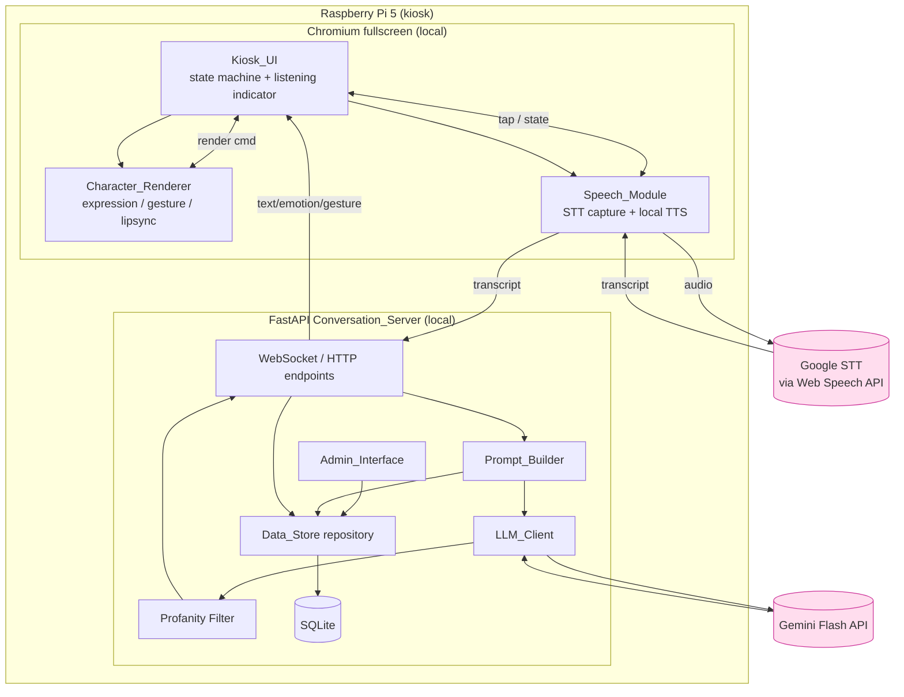
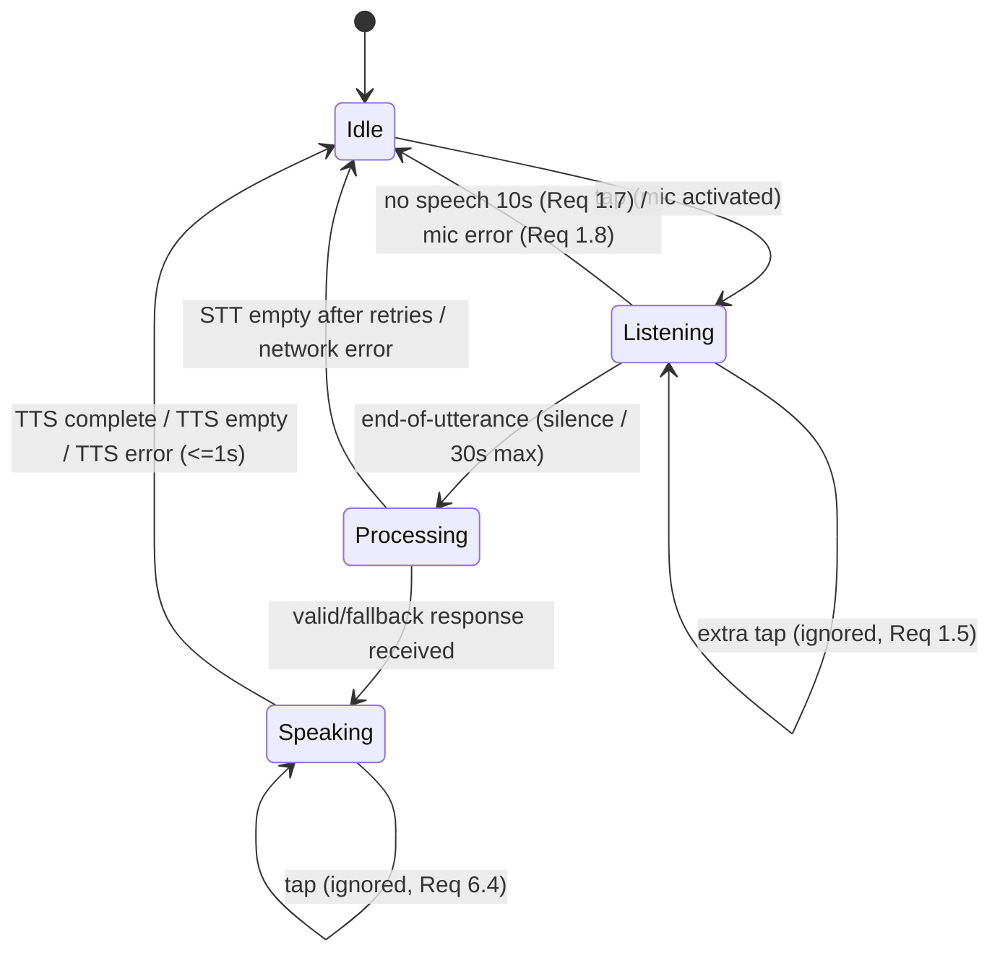
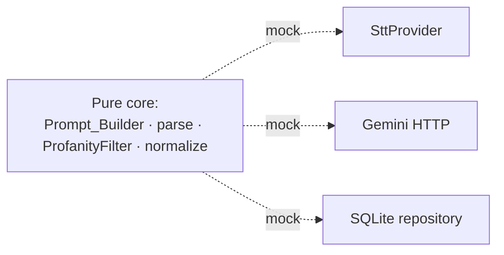

# Design Document

## Overview

The Vertew service is a single-user voice conversation system in which a friendly 2D merchant character converses with customers on behalf of a street-market vendor. It runs on a Raspberry Pi 5 (4GB) whose HDMI output drives a hologram display, with the customer-facing UI rendered in Chromium kiosk (fullscreen) mode.

The architecture is deliberately split to minimize internet usage on weak market wifi:

- **Browser (local, zero internet):** character rendering, screen-tap handling, speech capture (STT capture trigger), and text-to-speech synthesis.
- **FastAPI server (local, on the Pi):** conversation state, prompt construction, SQLite persistence, the admin interface, and the single outbound LLM call per turn.
- **Internet (text only):** the browser's Web Speech API STT (Chromium relays audio to Google's recognition service) and the Conversation_Server's Gemini Flash call.

The design treats the conversation flow as a small state machine driven by screen taps and timeouts. The server's core logic — prompt assembly, LLM response parsing, fallback substitution, emotion/gesture normalization, and profanity filtering — is implemented as pure, deterministic functions so it can be exhaustively validated with property-based tests. I/O boundaries (Gemini HTTP, SQLite, Web Speech API) are isolated behind interfaces so they can be mocked in tests and replaced later (e.g., a local STT provider).

### Key Design Decisions

| Decision | Rationale |
|----------|-----------|
| Browser ↔ server over a localhost WebSocket | Low-latency push for responses; satisfies "localhost only, no internet from UI" (Req 9.1). |
| Single combined Gemini call returning `{text, emotion, gesture}` JSON | One internet round-trip per turn; animation decided without extra calls (Req 9.3, Req 4). |
| Pure-function core for prompt/parse/filter | Deterministic, testable, decoupled from network and DB. |
| Speech_Module behind a provider interface | STT provider replaceable without touching UI or server (Req 2.6). |
| SQLite via a repository abstraction | Simple local persistence with retry semantics (Req 8). |
| Server-side profanity filter as the last gate | Guarantees the Kiosk_UI never receives flagged text regardless of model output (Req 10.1). |

## Architecture



### Conversation Flow

```mermaid
sequenceDiagram
    participant C as Customer
    participant UI as Kiosk_UI
    participant SM as Speech_Module
    participant SV as Conversation_Server
    participant G as Gemini Flash

    C->>UI: tap screen (idle)
    UI->>SM: activate mic (<=500ms)
    UI->>UI: show listening indicator (<=200ms)
    C->>SM: speak
    SM->>SM: detect end-of-speech (silence) / max 30s
    SM->>SV: transcript (>=1 word)
    SV->>SV: Prompt_Builder builds prompt (persona + store + <=5 turns)
    SV->>G: single combined call (timeout 10s, 1 retry)
    G-->>SV: {text, emotion, gesture}
    SV->>SV: parse -> fallback if invalid; profanity filter
    SV->>SV: record turn in Data_Store
    SV->>UI: text, emotion, gesture
    UI->>UI: render character; ignore taps during TTS
    UI->>SM: speak text (local TTS)
    SM-->>UI: TTS complete
    UI->>UI: return to idle (<=1s)
```

### Kiosk UI State Machine



The state machine is the authoritative model for tap handling, the listening indicator, and timeout behavior. Taps are only meaningful in `Idle`; they are explicitly ignored in `Listening` (Req 1.5) and `Speaking` (Req 6.4).

## Components and Interfaces

### Kiosk_UI

Owns the conversation state machine, the listening indicator, and error banners. Responsibilities:

- Handle screen taps according to current state (start capture only from `Idle`).
- Show the listening indicator within 200 ms of mic activation and keep it visible for the whole active period (Req 1.3).
- Route responses to Character_Renderer and Speech_Module.
- Ignore taps while TTS is playing (Req 6.4) and return to `Idle` within 1 s after voice output ends (Req 6.5).
- Display error messages for mic-unavailable, STT empty/retry, network, and TTS failures, returning to `Idle` where required.

```typescript
type UIState = "idle" | "listening" | "processing" | "speaking" | "error";

interface KioskController {
  onTap(): void;                       // honored only in "idle"
  onTranscript(text: string): void;    // from Speech_Module
  onServerResponse(r: CharacterResponse): void;
  onTtsComplete(): void;
  showError(kind: ErrorKind): void;    // mic | stt-empty | network | tts
  state: UIState;
}
```

### Speech_Module

Encapsulates STT capture and local TTS behind a provider interface so the STT backend is replaceable without changing the UI or server (Req 2.6, Req 9 STT isolation).

```typescript
interface SttProvider {
  start(): void;                       // activate mic, begin capture
  stop(): void;                        // deactivate mic
  // emits transcript on end-of-speech, or "no-match"/empty, or error
  onResult(cb: (r: SttResult) => void): void;
}

type SttResult =
  | { kind: "transcript"; text: string }   // >=1 recognized word
  | { kind: "no-match" }                    // empty / unrecognized
  | { kind: "error"; reason: "network" | "timeout" | "mic-unavailable" };

interface TtsEngine {
  speak(text: string): Promise<void>;      // local synthesis only (Req 6.2)
  isAvailable(): boolean;
}
```

Capture timing constants (browser side):

| Constant | Value | Source |
|----------|-------|--------|
| Mic activation latency budget | 500 ms | Req 1.2 |
| Listening indicator latency | 200 ms | Req 1.3 |
| End-of-utterance silence | 2–3 s | Req 1.4 / Req 2.2 |
| No-speech-after-activation timeout | 10 s | Req 1.7 |
| Max capture duration | 30 s | Req 1.6 |
| STT result timeout | 5 s | Req 2.1 / 2.5 |
| STT retry attempts (empty/no-match) | up to 3 | Req 2.4 |

### Character_Renderer

Renders the single 2D character (Live2D or PNG sprite). Maps each named Emotion to exactly one facial expression and each Gesture to exactly one body motion (Req 5.6). Unknown/empty values fall back to `neutral`/`idle` without interrupting rendering (Req 4.6, Req 5.2). Loops an idle animation when no conversation is active (Req 5.3) and lip-syncs the mouth to TTS within 150 ms (Req 5.4, 5.5).

```typescript
interface CharacterRenderer {
  render(emotion: string, gesture: string): void;  // normalizes unknown -> neutral/idle
  startLipSync(): void;
  stopLipSync(): void;                              // mouth closed within 150ms
  playIdle(): void;
}
```

### Conversation_Server (FastAPI)

Exposes a WebSocket for the conversation loop and HTTP routes for the admin interface. The request handler orchestrates the pure core:

```python
async def handle_transcript(transcript: str, session: Session) -> CharacterResponse:
    prompt = Prompt_Builder.build(persona, store_info, session.recent_turns(max=5), transcript)
    raw = await LLM_Client.complete(prompt)          # 10s timeout, <=1 retry
    parsed = LLM_Client.parse(raw)                   # -> CharacterResponse or fallback
    safe = ProfanityFilter.apply(parsed)             # last gate (Req 10.1/10.2)
    Data_Store.record_turn(transcript, safe.text, now())  # <=1 retry (Req 8.3)
    return safe
```

#### Prompt_Builder

Pure function assembling persona + current store/product info + recent turns (≤5) + the customer transcript, plus fixed instructions: JSON-only output schema, ≤500-char text, allowed Emotion/Gesture sets, grade-8 reading level, no profanity, polite vendor tone (Req 3, Req 10.3/10.4). When no store info exists, it instructs the model to state that no product info is available rather than omitting a response (Req 3.3).

```python
def build(persona: str | None,
          store_info: StoreInfo | None,
          recent_turns: list[ConversationTurn],   # builder clamps to last 5
          transcript: str) -> str: ...
```

#### LLM_Client

Isolates the Gemini Flash HTTP call and response parsing.

```python
async def complete(prompt: str) -> RawResponse: ...   # 10s timeout, 1 retry, single call

def parse(raw: RawResponse) -> CharacterResponse:
    # valid JSON with non-empty text + emotion + gesture -> truncate text to 1000 chars
    # invalid/missing field -> default neutral fallback (Req 4.4)
    # unreachable/error/timeout handled by caller -> temporarily-unavailable fallback (Req 4.5)
    ...
```

#### ProfanityFilter

```python
def apply(resp: CharacterResponse) -> CharacterResponse:
    # if resp.text matches any configured term -> replace entire response with
    # a courteous fallback that itself contains no flagged terms (Req 10.1)
    # else -> return unchanged (Req 10.2)
    ...
```

#### Admin_Interface + Data_Store repository

Serves `/admin` for viewing and editing store/product info and persona; validates field constraints; persists to SQLite with retry semantics. Loads store info at server startup (Req 8.2) and blocks new turns if the load fails (Req 8.4).

### Interface Boundaries (for replaceability and testing)



## Data Models

```python
# Allowed value sets (single source of truth, mirrored to the renderer)
EMOTIONS = {"happy", "neutral", "surprised", "sad", "angry"}   # >=1 required (Req 5.6)
GESTURES = {"wave", "idle", "point", "nod", "think"}           # >=1 required (Req 5.6)

DEFAULT_EMOTION = "neutral"
DEFAULT_GESTURE = "idle"

@dataclass
class CharacterResponse:
    text: str          # non-empty for valid; <=1000 chars after parse (Req 4.2)
    emotion: str       # in EMOTIONS or normalized to "neutral"
    gesture: str       # in GESTURES or normalized to "idle"
    is_fallback: bool = False

@dataclass
class StoreInfo:
    store_name: str    # 1..2000 chars (Req 7.3)
    products: str      # 1..2000 chars
    persona: str | None  # 1..500 chars when set (Req 7.7)

@dataclass
class ConversationTurn:
    customer_text: str
    character_text: str
    completed_at: datetime   # completion timestamp (Req 8.1)
```

### SQLite Schema

```sql
CREATE TABLE store_info (
    id          INTEGER PRIMARY KEY CHECK (id = 1),  -- single row
    store_name  TEXT NOT NULL,
    products    TEXT NOT NULL,
    persona     TEXT,
    updated_at  TEXT NOT NULL
);

CREATE TABLE conversation_turn (
    id            INTEGER PRIMARY KEY AUTOINCREMENT,
    customer_text TEXT NOT NULL,
    character_text TEXT NOT NULL,
    completed_at  TEXT NOT NULL
);
```

Committed records are immutable (insert-only conversation log; single-row upsert for store info), satisfying "records neither lost nor modified" across restarts (Req 8.5).

### Fallback Constants

| Constant | Value | Source |
|----------|-------|--------|
| `FALLBACK_UNDERSTAND` | text indicating the request could not be understood + `neutral`/`idle` | Req 4.4 |
| `FALLBACK_UNAVAILABLE` | text indicating the character is temporarily unavailable + `neutral`/`idle` | Req 4.5 |
| `FALLBACK_COURTEOUS` | profanity-free courteous response | Req 10.1 |

## Correctness Properties

*A property is a characteristic or behavior that should hold true across all valid executions of a system — essentially, a formal statement about what the system should do. Properties serve as the bridge between human-readable specifications and machine-verifiable correctness guarantees.*

The properties below were derived from the acceptance criteria. They target the deterministic, pure-function core of the system (prompt building, response parsing, normalization, profanity filtering, persistence round-trips, and the conversation state machine). Pure UI rendering, timing, kiosk deployment, and external-service wiring criteria are covered by example/integration/smoke tests in the Testing Strategy instead.

### Property 1: Prompt contains all required components and instructions

*For any* persona, store/product information, recent-turn history, and customer transcript, the prompt produced by `Prompt_Builder.build` SHALL contain the persona text, the current store and product information, the customer transcript, and the fixed instructions: the single-JSON-object output schema (non-empty text ≤500 chars, an emotion from the allowed set, a gesture from the allowed set), the grade-8 reading-level instruction, the no-profanity instruction, and the polite vendor-tone instruction.

**Validates: Requirements 3.1, 3.4, 3.5, 7.6, 7.7, 10.3, 10.4**

### Property 2: Absent store information yields a no-product-info instruction

*For any* input where no store or product information is available, the produced prompt SHALL include an instruction directing the model to state that no product information is currently available, while still including the persona and the recent-turn history.

**Validates: Requirements 3.3**

### Property 3: Recent-turn history is clamped to the five most recent in order

*For any* conversation-turn history, the turns included in the prompt SHALL be exactly the most recent `min(5, n)` turns, preserving their chronological order.

**Validates: Requirements 3.2**

### Property 4: Valid response parsing extracts fields and bounds text length

*For any* well-formed JSON response containing non-empty text and emotion and gesture fields, `LLM_Client.parse` SHALL extract the emotion and gesture values and produce a text value of at most 1000 characters.

**Validates: Requirements 4.2**

### Property 5: Malformed or incomplete responses become the neutral understanding fallback

*For any* response that is not valid JSON or is missing the text, emotion, or gesture field, `LLM_Client.parse` SHALL return the predefined "could not be understood" fallback text with emotion `neutral` and gesture `idle`.

**Validates: Requirements 4.4**

### Property 6: Network failures become the temporarily-unavailable fallback

*For any* Gemini request that is unreachable, returns an error status, or exceeds the timeout, the Conversation_Server SHALL return the predefined "temporarily unavailable" fallback text with emotion `neutral` and gesture `idle`.

**Validates: Requirements 4.5**

### Property 7: Emotion and gesture normalization is total

*For any* emotion string and gesture string, normalization SHALL return the value unchanged when it belongs to the allowed Emotion/Gesture set, and SHALL return `neutral`/`idle` respectively when the value is missing, empty, or not in the set; every value in the allowed sets maps to exactly one defined expression/motion.

**Validates: Requirements 4.6, 5.2, 5.6**

### Property 8: Profanity filtering replaces flagged responses and preserves clean ones

*For any* parsed response text, if the text contains one or more terms from the configured profanity list then `ProfanityFilter.apply` SHALL return the predefined courteous fallback (which itself contains no flagged terms); otherwise it SHALL return the response unchanged.

**Validates: Requirements 10.1, 10.2**

### Property 9: Persistence round-trip preserves committed records across restarts

*For any* sequence of committed store-info writes and conversation-turn records, reopening the Data_Store SHALL return exactly those records, unchanged and none lost (the most recent store info and all recorded turns with their transcript, response text, and timestamp).

**Validates: Requirements 8.1, 8.2, 8.5**

### Property 10: Storage writes retry at most once

*For any* conversation-turn write that fails, the Conversation_Server SHALL attempt the write at most twice (initial attempt plus at most one retry) before reporting failure, and previously committed records SHALL remain unchanged.

**Validates: Requirements 8.3**

### Property 11: Network requests retry at most once

*For any* speech-to-text or Gemini request that fails or times out, the Conversation_Server SHALL issue at most two attempts (initial plus at most one retry) before reporting failure.

**Validates: Requirements 9.6**

### Property 12: Exactly one Gemini call per conversation turn

*For any* conversation turn, the LLM_Client SHALL issue exactly one Gemini Flash call for that turn (and never more than one).

**Validates: Requirements 9.3**

### Property 13: Screen taps are honored only in the idle state

*For any* sequence of screen taps, taps received while the UI is in the listening or speaking state SHALL be ignored — they SHALL NOT change the conversation state nor reset the in-progress silence period.

**Validates: Requirements 1.5, 6.4**

### Property 14: Only non-empty transcripts/texts proceed; whitespace-only is skipped

*For any* transcript, the Speech_Module SHALL forward it to the Conversation_Server only when it contains at least one recognized word, and *for any* response text that is empty or whitespace-only the Speech_Module SHALL skip synthesis and the UI SHALL return to idle.

**Validates: Requirements 2.3, 6.7**

### Property 15: Empty/no-match STT retries are capped at three

*For any* sequence of empty or no-match speech-to-text results, the Kiosk_UI SHALL allow at most 3 consecutive retry attempts while retaining the idle-ready state.

**Validates: Requirements 2.4**

### Property 16: Store-info validation accepts only well-formed fields

*For any* store/product/persona submission, validation SHALL accept it only when every required field is non-empty and within its length bound (store/product 1–2000 chars, persona 1–500 chars when set), and SHALL otherwise reject it while identifying an invalid field.

**Validates: Requirements 7.3, 7.4**

## Error Handling

Errors are handled at the layer that owns the failing resource, with a user-visible indication and a defined recovery state. No partial output is ever shown to the customer.

| Scenario | Detection | Handling | Recovery state | Req |
|----------|-----------|----------|----------------|-----|
| Microphone denied/unavailable | `SttResult.error: mic-unavailable` | Keep mic inactive, show "microphone unavailable" | Idle | 1.8 |
| No speech after activation | 10 s timer | Deactivate mic | Idle | 1.7 |
| Max capture reached | 30 s timer | Treat audio as completed utterance | Processing | 1.6 |
| STT empty / no-match | `SttResult.no-match` | Prompt "tap and speak again"; allow ≤3 retries | Idle-ready | 2.4 |
| STT timeout / network fail | 5 s timer / `error: network` | Connectivity error; do not send transcript | Idle | 2.5 |
| Gemini invalid/missing fields | `parse` validation | Substitute `FALLBACK_UNDERSTAND` (neutral/idle) | Speaking (fallback) | 4.4 |
| Gemini unreachable/error/timeout | HTTP layer (10 s, ≤1 retry) | Substitute `FALLBACK_UNAVAILABLE` (neutral/idle); abort, no partial output | Speaking (fallback) | 4.5, 9.5, 9.6 |
| Unknown emotion/gesture | Normalization | Render `neutral`/`idle`, continue | unchanged | 4.6, 5.2 |
| Profanity in response | `ProfanityFilter.apply` | Replace whole response with `FALLBACK_COURTEOUS` | Speaking | 10.1 |
| TTS unavailable / no start in 1 s | `TtsEngine.isAvailable` / timer | Show "voice could not be produced" | Idle (≤1 s) | 6.6 |
| Empty/whitespace response text | Pre-synthesis check | Skip synthesis | Idle (≤1 s) | 6.7 |
| Admin validation failure | Field validation | Reject, retain entered values, identify field | Admin form | 7.4 |
| Storage write failure | Repository exception | Retry ≤1; then error; prior records unchanged | Admin/turn error | 8.3, 8.5 |
| Startup load failure | Startup load | Error indication; block new turns | Blocked | 8.4 |
| Chromium fullscreen launch failure | Autostart script (60 s) | Retry ≤3; then on-screen failure indication | — | 11.5 |

## Testing Strategy

A dual approach is used: property-based tests verify the universal properties of the pure core across many generated inputs, while example, integration, and smoke tests cover specific scenarios, timing, external-service wiring, and deployment.

### Property-Based Tests

PBT applies to the Conversation_Server core and the state-machine model, which are pure and input-varying. Implementation rules:

- Use an established PBT library for the target language: **Hypothesis** for the Python server (`Prompt_Builder`, `LLM_Client.parse`, normalization, `ProfanityFilter`, repository round-trips, retry/call-count logic) and **fast-check** for the TypeScript browser-side state machine (tap handling, transcript/whitespace handling, STT retry cap).
- Do **not** implement property testing from scratch.
- Run a **minimum of 100 iterations** per property test.
- Tag each test with a comment referencing its design property, in the format: **Feature: vertew, Property {number}: {property_text}**.
- Implement each correctness property with a **single** property-based test.
- Mock external boundaries (Gemini HTTP, SQLite file, Web Speech API) so properties test logic without real network/disk cost. For Property 9, use a real temporary on-disk SQLite file and reopen it to exercise true persistence.

Generators of note:
- Store/persona/transcript/turn-history generators including empty, whitespace-only, max-length (2000/500/1000), and unicode inputs.
- Response generators producing valid JSON, malformed JSON, and field-missing variants.
- Emotion/gesture generators mixing in-set values with arbitrary/empty strings.
- Profanity generators that embed configured terms at varying positions (start, middle, substring boundaries) plus clean-text generators.
- Tap-sequence and STT-result-sequence generators for the state-machine properties.

### Example / Unit Tests

Concrete scenarios and boundaries: mic activation and indicator latency (1.2, 1.3), silence and max-capture timers (1.4, 1.6, 1.7), STT timeout path (2.5), valid-parse forwarding (4.3), idle animation (5.3), lip-sync start/stop timing (5.4, 5.5), TTS start and return-to-idle timing (6.1, 6.5, 6.6), admin load and empty-field display (7.1, 7.2), storage-failure and startup-load-failure paths (7.5, 8.4), and the abort/no-partial-output path (9.5).

### Integration Tests (1–3 examples each)

External-service behavior and network constraints, not input-varying: STT conversion latency against the provider (2.1), Gemini single-call with 10 s timeout (4.1, 9.4), TTS issuing zero network requests (6.2), Kiosk_UI talking only to localhost (9.1), and the server's outbound requests limited to STT + Gemini (9.2).

### Smoke / Config Tests (single execution)

One-time setup checks: STT provider exposed behind the replaceable interface (2.6), English TTS voice configured (6.3), Chromium kiosk autostart and fullscreen flags hiding navigation/address bar (11.1, 11.3). Display layout/cursor-hiding (11.2, 11.4) and launch-retry (11.5) are verified manually or via the autostart script's example test.
